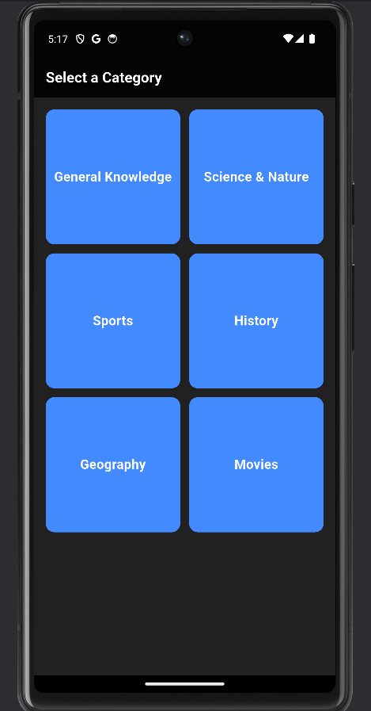
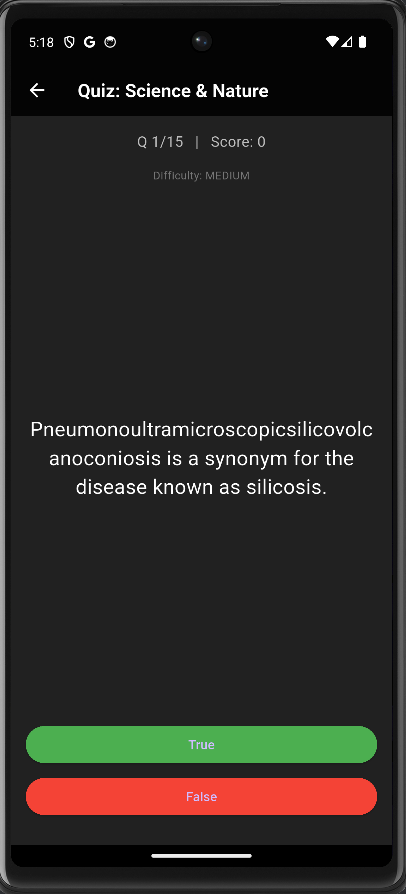
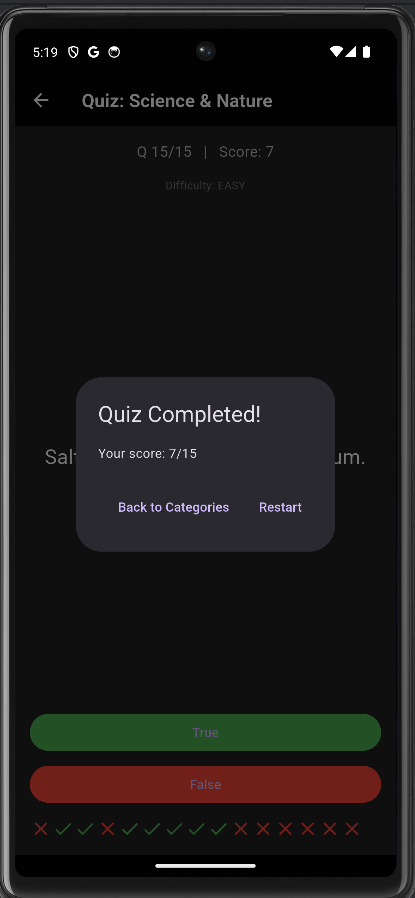

# 🎯 QuizForge - Flutter Quiz App


**QuizForge** is a **dynamic, gamified Flutter quiz app** that challenges users’ knowledge with real-time scoring, adaptive difficulty, and a sleek dark-themed interface. Perfect for showcasing Flutter, Dart, and API integration skills.

---

## 🎬 Demo

  

*Dynamic categories, adaptive difficulty, and instant feedback in action.*

---

## 🚀 Key Features

- **Dynamic Quiz Categories** fetched from [Open Trivia Database (OpenTDB)](https://opentdb.com/)  
- **AI-style Adaptive Difficulty**:
  - Starts easy, scales with correct answer streaks
  - Wrong answers reduce difficulty, ensuring balanced learning
- **Instant Feedback & Score Tracking**:
  - ✔️ Correct / ❌ Wrong indicators
  - Retry or restart options for better learning
- **Modern, Dark-themed UI**:
  - Clean and responsive Material Design
  - Smooth transitions and animations
- **Extensible Architecture**:
  - Modular folder structure ready for scaling and feature expansion

---

## 📸 Screenshots

### Category Screen
  
*Select your preferred quiz category.*

### Quiz In-Progress
  
*Answer questions with instant feedback and scoring.*

### Quiz Completed
  
*See results and retry for a better score.*

---

## 🛠 Installation & Setup

### Prerequisites

- Flutter 3.8.1+
- Dart SDK 3.0+
- Internet connection (for API requests)

### Steps

```bash
# Clone repository
git clone https://github.com/yourusername/quizforge.git
cd quizforge

# Install dependencies
flutter pub get

# Run the app
flutter run
🏗 Project Structure
bash
Copy
Edit
QuizForge/
 ├─ android/
 ├─ ios/
 ├─ linux/
 ├─ macos/
 ├─ web/
 ├─ demo/                # Demo GIF/video folder
 ├─ lib/
 │   ├─ data/
 │   │   └─ categories.dart
 │   ├─ models/
 │   │   └─ quiz_category.dart
 │   ├─ screens/
 │   │   ├─ category_screen.dart
 │   │   └─ quiz_page.dart
 │   ├─ categories.dart
 │   ├─ main.dart
 │   ├─ questions.dart
 │   └─ quiz_brain.dart
 ├─ models/
 ├─ test/
 ├─ build/
 ├─ .dart_tool/
 └─ .idea/


🌟 Future Enhancements

AI-powered question recommendations based on user performance

Timer-based challenges & competitive leaderboards

Multiple question types: multiple choice, fill-in-the-blank, and more

Persistent high-score tracking and analytics dashboards

Social sharing of achievements

🛠 Tech Stack & Tools

Flutter & Dart – Cross-platform development

OpenTDB API – Real-time quiz content

Material Design – Modern, responsive UI/UX

State Management – Provider / Riverpod (optional)

Animations & Transitions – Smooth interactive experience

📌 Why This Project Matters

Demonstrates modular Flutter architecture & clean code

Implements API integration and asynchronous data handling

Shows adaptive difficulty logic, UX gamification & state management

Ready to be scaled with analytics, leaderboards, and social features

📝 Author

Aditya Chaturvedi
GitHub: https://github.com/Aditya-dev2005
